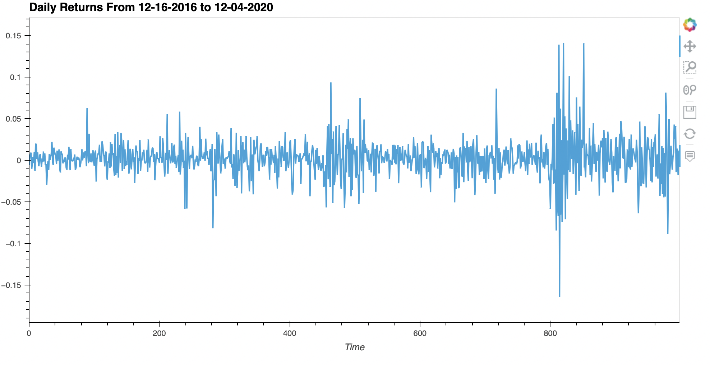

# ETF_Analyzer

This analysis uses Python, Pandas, Jupyter, and SQL to pull ETF portfolio data from a database and analyze both single assets and the whole portfolio. Deployable as web app using voila.


---

## Technologies

This project leverages python with the following packages:

* [Pandas](https://github.com/pandas-dev/pandas) - For plotting, dataframes, import of SQL queries, and calculations.

* [PyViz](https://github.com/pyviz/pyviz.org) - For plotting with hvplot.

* [SQLAlchemy](https://github.com/sqlalchemy/sqlalchemy) - For database operations.

* [Voila](https://github.com/voila-dashboards/voila) - For web deployment.

---

## Installation Guide

Before first running the application install the following dependencies:

```python
    pip install pandas
    pip install voila
    pip install SQLAlchemy
```

Login to Conda `Dev` environment and install the following dependencies:

```python
    conda install -c pyviz hvplot
```

Jupyter may be required to view the .ipynb file.

```python
    pip install jupyter
```

---

## Usage

Usage is primarily viewing data and visuals but can be repurposed to take different data and help identify or backtest. To deploy as a web app, open the terminal and enter:

```python
voila etf_analyzer.ipynb
```

This will deploy the notebook as an interactive web app like the example pictured below.



---
